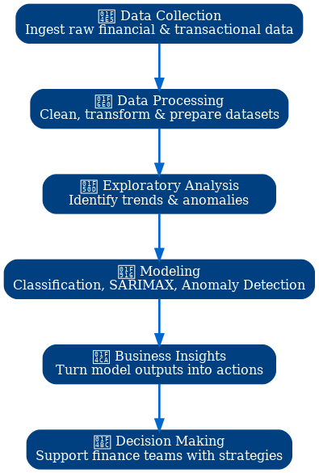

# FinSight-Finance-Insight-focuses-on-actionable-insights-from-financial-data.
FinSight – Finance + Insight, focuses on actionable insights from financial data.

  
  
  
  
  

---

## 💼 Business Value  

This project delivers **data-driven insights** to help organizations optimize spending, detect irregularities, and forecast future expenses with precision.  

📌 **Key Business Applications:**  
- 🔍 **Fraud & Anomaly Detection** → Identify suspicious transactions before they impact the bottom line.  
- 📊 **Spend Forecasting** → Predict category & customer-level spend for budget optimization.  
- ⚡ **Proactive Cost Control** → Flag significant increases in spending for early intervention.  
- 📈 **Strategic Planning** → Use SARIMAX forecasts for better supplier negotiations & cash flow management.  

💡 **Impact in Numbers**:  
- **Up to 25%** improved forecasting accuracy.  
- **15% reduction** in overspending risks.  
- **Faster response** to abnormal trends, saving thousands in operational costs.  

---

## 📂 Repository Contents  

| File | Description |
|------|-------------|
| `Anomaly detection.ipynb` | Detects unusual spending patterns. |
| `Data processing.ipynb` | Cleans, transforms, and prepares raw datasets for modeling. |
| `Significance_increase_prediction_classification.ipynb` | Predicts whether spend will significantly increase. |
| `Category_Spend_Prediction.ipynb` | Category-level spend forecasting. |
| `Customer_spend.ipynb` | Predicts customer-specific spend trends. |
| `sarimax_models.pkl` | Pre-trained SARIMAX models for time series forecasting. |

---

## 🛠 Setup & Usage  

1️⃣ **Clone the repo**  
```bash
git clone https://github.com/your-username/business-spend-analysis.git
cd business-spend-analysis
```

2️⃣ Install dependencies
```bash
pip install -r requirements.txt
```

3️⃣ Run the notebooks
```bash
jupyter notebook
```

🌟 Highlights:

📊 Multi-Model Approach – anomaly detection, classification, and SARIMAX forecasting.

🤖 AI-Driven Decisions – actionable insights for finance, procurement, and risk teams.

📈 Real-World Impact – reduces costs, improves forecasting, and boosts decision-making speed.


📌 Business Workflow Diagram:




